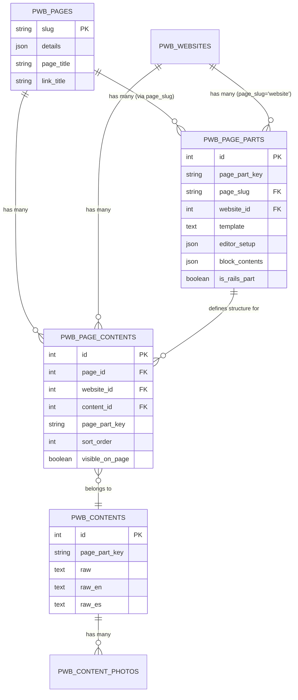
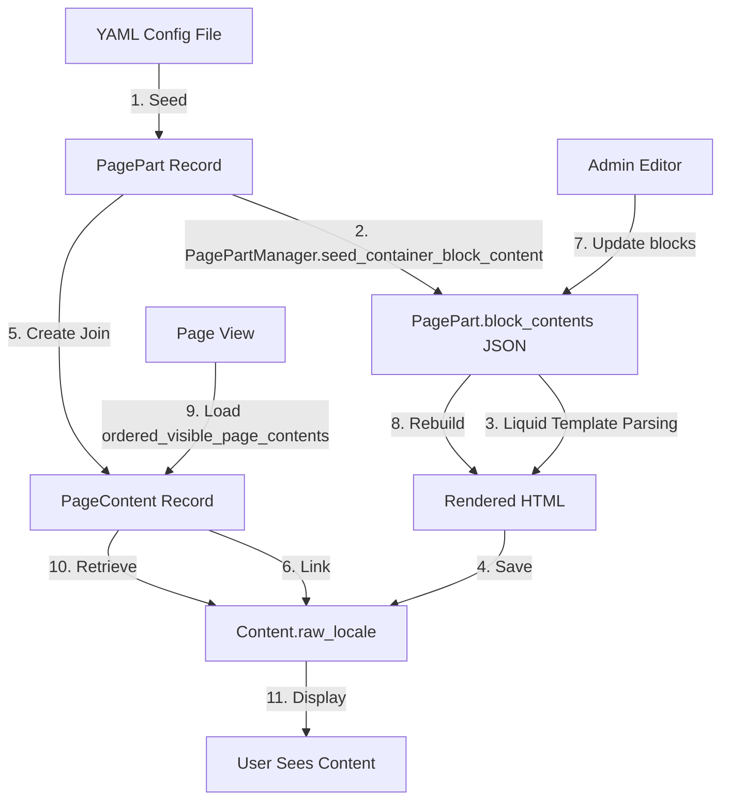

# PagePart System Documentation

## Table of Contents
1. [Overview](#overview)
2. [Architecture](#architecture)
3. [Core Components](#core-components)
4. [How It Works](#how-it-works)
5. [Theme Integration](#theme-integration)
6. [Usage Examples](#usage-examples)
7. [Multi-Tenancy & Tenant Isolation](#multi-tenancy--tenant-isolation)
8. [Pros and Cons Analysis](#pros-and-cons-analysis)
9. [Recommendations for Improvement](#recommendations-for-improvement)

---

## Overview

The **PagePart** system in Property Web Builder is a content management architecture that enables dynamic, multi-locale page composition using **Liquid templates** and **editable content blocks**. It allows non-technical users to edit structured content through a visual editor while maintaining consistent layouts defined by templates.

### Key Concept
PageParts separate **structure** (templates) from **content** (strings, images, HTML), enabling:
- Multi-language content without duplicating templates
- Visual editing of page sections without touching code
- Reusable content across different pages
- Theme-agnostic content storage

---

## Architecture

### Database Schema

The system consists of three primary tables:

#### 1. `pwb_page_parts`
Defines the **structure and configuration** of each page section.

```ruby
# Key columns:
page_part_key       # Unique identifier (e.g., "landing_hero", "our_agency")
page_slug           # Associated page (e.g., "home", "about-us") or "website" for global parts
website_id          # Tenant isolation - each page_part belongs to a specific website
template            # Liquid template HTML
editor_setup        # JSON configuration for the editor UI
block_contents      # JSON storing actual content per locale
is_rails_part       # Boolean - if true, uses Rails partial instead of template
show_in_editor      # Boolean - visibility in admin editor
order_in_editor     # Sort order in admin UI
theme_name          # Optional future use for theme-specific templates
locale              # Optional future use for locale-specific templates
```

#### 2. `pwb_page_contents` (Join Model)
Acts as a **join table** between pages/websites and content, storing **display metadata**.

```ruby
# Key columns:
page_id             # Associated page (optional - can be website-level)
website_id          # Associated website (optional)
content_id          # Associated content
page_part_key       # Links to pwb_page_parts
sort_order          # Display order on page
visible_on_page     # Boolean - show/hide content
is_rails_part       # Boolean - whether this uses a Rails component
```

**Why a join model?**
- Allows the same content to appear on multiple pages with different visibility/sort settings
- Provides flexibility for future content reuse scenarios
- Separates content ownership from presentation concerns

#### 3. `pwb_contents`
Stores the **actual rendered HTML content** in multiple locales.

```ruby
# Key columns:
page_part_key       # Links back to page part definition
website_id          # Associated website
raw                 # Default locale HTML content
raw_en, raw_es, etc # Globalized columns for each locale
```

### Entity Relationships



---

## Core Components

### 1. PagePart Model

**File:** [`app/models/pwb/page_part.rb`](file:///Users/etewiah/dev/sites-legacy/property_web_builder/app/models/pwb/page_part.rb)

```ruby
class PagePart < ApplicationRecord
  belongs_to :page, optional: true, foreign_key: "page_slug", primary_key: "slug"
  belongs_to :website, optional: true  # Tenant isolation
  
  # Loads configuration from YAML seed files
  def self.create_from_seed_yml(yml_file_name)
    # Creates PagePart from db/yml_seeds/page_parts/*.yml
  end
end
```

**Responsibilities:**
- Stores template and editor configuration
- Belongs to either a Page (via `page_slug`) or Website (`page_slug = "website"`)
- Loaded from YAML configuration files during seeding
- **Tenant-scoped**: Each website has its own isolated page_parts

**Multi-Tenancy:**
For tenant-isolated operations, use the scoped model:
```ruby
# app/models/pwb_tenant/page_part.rb
module PwbTenant
  class PagePart < Pwb::PagePart
    include PwbTenant::ScopedModel  # Automatic website_id scoping
  end
end

# Usage:
PwbTenant::PagePart.all  # Returns only current website's page_parts
```

### 2. PagePartManager Service

**File:** [`app/services/pwb/page_part_manager.rb`](file:///Users/etewiah/dev/sites-legacy/property_web_builder/app/services/pwb/page_part_manager.rb)

The **manager class** orchestrates all page_part operations.

```ruby
class PagePartManager
  attr_accessor :page_part_key, :page_part, :container
  
  def initialize(page_part_key, container)
    # container = Page or Website instance
    self.container = container
    self.page_part = container.get_page_part(page_part_key)
  end
end
```

**Key Methods:**

| Method | Purpose |
|--------|---------|
| `find_or_create_content` | Creates Content record and PageContent join model |
| `find_or_create_join_model` | Ensures PageContent record exists (critical for Rails parts) |
| `seed_container_block_content` | Populates content from YAML seed files |
| `update_page_part_content` | Updates block contents and regenerates HTML |
| `set_default_page_content_order_and_visibility` | Sets initial display settings |
| `rebuild_page_content` | Parses Liquid template with block contents to generate HTML |

**Workflow Example:**

```ruby
# 1. Initialize manager
manager = PagePartManager.new("landing_hero", home_page)

# 2. Seed content from YAML
seed_content = {
  "landing_title_a" => "Welcome to Our Agency",
  "landing_content_a" => "<p>Your trusted real estate partner</p>",
  "landing_img" => "path/to/image.jpg"
}
manager.seed_container_block_content("en", seed_content)

# 3. Result:
# - block_contents['en'] stored in PagePart
# - Liquid template rendered with block data
# - HTML saved to Content.raw_en
```

### 3. Page and Website Models

Both [`Page`](file:///Users/etewiah/dev/sites-legacy/property_web_builder/app/models/pwb/page.rb) and [`Website`](file:///Users/etewiah/dev/sites-legacy/property_web_builder/app/models/pwb/website.rb) act as **containers** for page_parts:

```ruby
class Page < ApplicationRecord
  has_many :page_parts, foreign_key: "page_slug", primary_key: "slug"
  has_many :page_contents
  has_many :contents, through: :page_contents
  has_many :ordered_visible_page_contents, -> { ordered_visible }
  
  def get_page_part(page_part_key)
    page_parts.where(page_part_key: page_part_key).first
  end
end

class Website < ApplicationRecord
  has_many :page_contents
  has_many :contents, through: :page_contents
  has_many :ordered_visible_page_contents, -> { ordered_visible }
  
  def page_parts
    PagePart.where(page_slug: "website")
  end
  
  def get_page_part(page_part_key)
    page_parts.where(page_part_key: page_part_key).first
  end
end
```

**Note:** Website-level page_parts (e.g., footer) have `page_slug = "website"` and are accessible across all pages.

### 4. Content and PageContent Models

**[`Content`](file:///Users/etewiah/dev/sites-legacy/property_web_builder/app/models/pwb/content.rb)** stores rendered HTML:
```ruby
class Content < ApplicationRecord
  belongs_to :website, optional: true
  has_many :content_photos, dependent: :destroy
  has_many :page_contents
  has_many :pages, through: :page_contents
  
  translates :raw  # Globalize gem for i18n
end
```

**[`PageContent`](file:///Users/etewiah/dev/sites-legacy/property_web_builder/app/models/pwb/page_content.rb)** join model:
```ruby
class PageContent < ApplicationRecord
  belongs_to :page, optional: true
  belongs_to :content, optional: true
  belongs_to :website, optional: true
  
  validates_presence_of :page_part_key
  
  scope :ordered_visible, -> { 
    includes(content: :translations)
      .where(visible_on_page: true)
      .order("sort_order asc")
  }
end
```

---

## How It Works

### Content Lifecycle



### Step-by-Step Workflow

#### 1. **Seeding Phase** (Initial Setup)

```ruby
# db/yml_seeds/page_parts/home__landing_hero.yml
- page_slug: home
  page_part_key: landing_hero
  editor_setup:
    editorBlocks:
      - - label: "landing_title_a"
          isSingleLineText: "true"
      - - label: "landing_img"
          isImage: "true"
  template: |
    <div class="hero">
      <h1>{{ page_part["landing_title_a"]["content"] }}</h1>
      
    </div>
```

**Seeder Process:**
1. [`PagesSeeder.seed_page_parts!`](file:///Users/etewiah/dev/sites-legacy/property_web_builder/lib/pwb/pages_seeder.rb) creates PagePart records
2. [`ContentsSeeder.seed_contents!`](file:///Users/etewiah/dev/sites-legacy/property_web_builder/lib/pwb/contents_seeder.rb) populates actual content:
   ```ruby
   page_part_manager = PagePartManager.new("landing_hero", home_page)
   page_part_manager.seed_container_block_content("en", seed_content)
   page_part_manager.set_default_page_content_order_and_visibility
   ```

#### 2. **Content Editing** (Admin Panel)

**API Endpoint:** [`Api::V1::PageController#save_page_fragment`](file:///Users/etewiah/dev/sites-legacy/property_web_builder/app/controllers/pwb/api/v1/page_controller.rb#L65-L99)

```ruby
# POST /api/v1/page/save_fragment
# Params:
{
  page_slug: "home",
  fragment_details: {
    page_part_key: "landing_hero",
    locale: "en",
    blocks: {
      landing_title_a: { content: "New Title" },
      landing_img: { content: "https://example.com/image.jpg" }
    }
  }
}

# Controller logic:
page_part_manager = PagePartManager.new(page_part_key, container)
result = page_part_manager.update_page_part_content(locale, fragment_details)
# Returns: { json_fragment_block: {...}, fragment_html: "..." }
```

**Under the Hood:**
1. Updates `PagePart.block_contents[locale]` with new values
2. Renders Liquid template with updated blocks
3. Saves rendered HTML to `Content.raw_[locale]`
4. Returns both JSON and HTML to admin client

#### 3. **Rendering** (Public View)

**Controller:** [`PagesController#show_page`](file:///Users/etewiah/dev/sites-legacy/property_web_builder/app/controllers/pwb/pages_controller.rb)

```ruby
@page = current_website.pages.find_by_slug("home")
@page.ordered_visible_page_contents.each do |page_content|
  @content_to_show.push page_content.content.raw
end
```

**View Helper:** [`ComponentHelper#page_part`](file:///Users/etewiah/dev/sites-legacy/property_web_builder/app/helpers/pwb/component_helper.rb)

```erb
<!-- app/views/pwb/pages/show.html.erb -->
<% @page.ordered_visible_page_contents.each do |page_content| %>
  <%= page_part(page_content) %>
<% end %>
```

**Partial:** [`_generic_page_part.html.erb`](file:///Users/etewiah/dev/sites-legacy/property_web_builder/app/themes/default/views/pwb/components/_generic_page_part.html.erb)

```erb
<div class="col-md-12">
  <%== content %>
</div>
```

---

## Theme Integration

### Theme Structure

Themes are located in [`app/themes/`](file:///Users/etewiah/dev/sites-legacy/property_web_builder/app/themes) and can override default components:

```
app/themes/
├── default/
│   └── views/pwb/components/
│       └── _generic_page_part.html.erb
├── berlin/
│   └── views/pwb/components/
│       └── _generic_page_part.html.erb (theme-specific wrapper)
└── [theme_name]/
    ├── config.yml                    # Theme metadata
    └── views/pwb/components/
        └── _generic_page_part.html.erb
```

### How Themes Work with PageParts

1. **Content is Theme-Agnostic**: PagePart templates and content are stored independently of themes
2. **Wrapper Control**: Themes customize the `_generic_page_part.html.erb` wrapper that surrounds rendered content
3. **Future Support**: The schema includes `theme_name` and `locale` columns for potential theme/locale-specific templates (not currently implemented)

**Example Theme Override:**

```erb
<!-- themes/berlin/_generic_page_part.html.erb -->
<section class="berlin-section">
  <div class="container">
    <%== content %>
  </div>
</section>
```

### Rails Parts vs. Template Parts

The system supports two types of page parts:

| Type | `is_rails_part` | Rendering Method |
|------|----------------|------------------|
| **Template Part** | `false` | Renders Liquid template stored in `PagePart.template` |
| **Rails Part** | `true` | Renders Rails partial from `app/views/pwb/components/[page_part_key].html.erb` |

**Rails Part Example:**
```ruby
# page_part_key: "search_cmpt"
# is_rails_part: true
# Template: (empty)

# Renders: app/views/pwb/components/_search_cmpt.html.erb
```

**Use Case:** Rails parts are used for dynamic components that need server-side logic (e.g., search forms, property listings).

---

## Usage Examples

### Example 1: Creating a New Page Section

**Step 1:** Create YAML configuration

```yaml
# db/yml_seeds/page_parts/about-us__our_team.yml
- page_slug: about-us
  page_part_key: our_team
  block_contents: {}
  order_in_editor: 3
  show_in_editor: true
  editor_setup:
    tabTitleKey: "pageSections.ourTeam.title"
    tabInfoKey: "pageSections.ourTeam.info"
    default_sort_order: 3
    default_visible_on_page: true
    editorBlocks:
      - - label: "team_title"
          isSingleLineText: "true"
      - - label: "team_description"
          isMultipleLineText: "true"
      - - label: "team_photo"
          isImage: "true"
  template: |
    <section class="team-section">
      <h2>{{ page_part["team_title"]["content"] }}</h2>
      <p>{{ page_part["team_description"]["content"] }}</p>
      
    </section>
```

**Step 2:** Seed the database

```bash
rails db:seed
# Or manually:
Pwb::PagePart.create_from_seed_yml("about-us__our_team.yml")
```

**Step 3:** Populate content

```yaml
# db/yml_seeds/content_translations/en.yml
en:
  about-us:
    our_team:
      team_title: "Meet Our Team"
      team_description: "We are a dedicated group of professionals..."
      team_photo: "db/seeds/images/team.jpg"
```

### Example 2: Website-Level Footer

```yaml
# db/yml_seeds/page_parts/website__footer_content_html.yml
- page_slug: website  # Available on all pages
  page_part_key: footer_content_html
  template: |
    <footer>
      <div class="footer-content">
        {{ page_part["main_content"]["content"] }}
      </div>
    </footer>
```

**Access in Layout:**

```ruby
# app/controllers/pwb/application_controller.rb
before_action :set_footer_content

def set_footer_content
  footer_page_content = current_website&.ordered_visible_page_contents&.find_by_page_part_key("footer_content_html")
  @footer_content = footer_page_content.present? ? footer_page_content.content : OpenStruct.new
end
```

### Example 3: Multi-Locale Content

```ruby
# Update Spanish content
manager = PagePartManager.new("landing_hero", home_page)

es_content = {
  "landing_title_a" => "Bienvenido a Nuestra Agencia",
  "landing_content_a" => "<p>Su socio inmobiliario de confianza</p>"
}

manager.seed_container_block_content("es", es_content)

# Access in view (auto-switches based on I18n.locale)
home_page.contents.find_by_page_part_key("landing_hero").raw
# => Returns raw_es if I18n.locale == :es
```

---

## Multi-Tenancy & Tenant Isolation

### Overview

The PagePart system is **fully tenant-scoped** to ensure complete data isolation between different websites/tenants. Each tenant has their own independent set of page_parts, preventing cross-tenant data contamination.

### Tenant-Scoped Models

The following models are tenant-isolated via the `PwbTenant` namespace:

**[`PwbTenant::PagePart`](file:///Users/etewiah/dev/sites-legacy/property_web_builder/app/models/pwb_tenant/page_part.rb)**
```ruby
module PwbTenant
  class PagePart < Pwb::PagePart
    include PwbTenant::ScopedModel
    # Automatically scoped to current website via default_scope
  end
end
```

**[`PwbTenant::PageContent`](file:///Users/etewiah/dev/sites-legacy/property_web_builder/app/models/pwb_tenant/page_content.rb)**
```ruby
module PwbTenant
  class PageContent < Pwb::PageContent
    include PwbTenant::ScopedModel
    # Automatically scoped to current website via default_scope
  end
end
```

**[`PwbTenant::Page`](file:///Users/etewiah/dev/sites-legacy/property_web_builder/app/models/pwb_tenant/page.rb)** and **[`PwbTenant::Content`](file:///Users/etewiah/dev/sites-legacy/property_web_builder/app/models/pwb_tenant/content.rb)** are also tenant-scoped.

### How Tenant Scoping Works

The `PwbTenant::ScopedModel` concern provides automatic tenant isolation:

```ruby
module PwbTenant
  module ScopedModel
    included do
      # Automatic scope to current website
      default_scope { where(website_id: Pwb::Current.website&.id) }
      
      # Auto-assign website on creation
      before_validation :set_current_website
    end
  end
end
```

**Benefits:**
- All queries automatically filtered by `website_id`
- New records automatically assigned to current website
- Prevents accidental cross-tenant data access
- Eliminates need for manual `where(website_id: ...)` clauses

### Usage Examples

#### Creating Tenant-Scoped PageParts

```ruby
# Set current website context
Pwb::Current.website = Website.find_by_subdomain('tenant-a')

# Create page_part - automatically assigned to tenant-a
page_part = PwbTenant::PagePart.create!(
  page_part_key: "custom_hero",
  page_slug: "home",
  template: "<h1>{{ page_part['title']['content'] }}</h1>",
  editor_setup: { editorBlocks: [[{ label: "title" }]] }
)
# => website_id automatically set to tenant-a's ID

# Switch context
Pwb::Current.website = Website.find_by_subdomain('tenant-b')

# Query only returns tenant-b's page_parts
PwbTenant::PagePart.all  # => Only tenant-b's records
PwbTenant::PagePart.find_by(page_part_key: "custom_hero")  # => nil (tenant-a's record not visible)
```

#### PagePartManager with Tenant Scoping

```ruby
# PagePartManager works with both scoped and unscoped models
Pwb::Current.website = current_website

page = PwbTenant::Page.find_by_slug("home")  # Tenant-scoped
manager = Pwb::PagePartManager.new("landing_hero", page)

# Manager operates within tenant context
manager.seed_container_block_content("en", content_data)
# => Creates Content with website_id from current context
```

### Migration Strategy

When the `website_id` column was added to `pwb_page_parts`, a comprehensive migration handled existing data:

**[Migration: `AddWebsiteIdToPageParts`](file:///Users/etewiah/dev/sites-legacy/property_web_builder/db/migrate/20251202112123_add_website_id_to_page_parts.rb)**

1. **Page-level page_parts**: Assigned `website_id` based on their associated page's `website_id`
2. **Website-level page_parts** (`page_slug = "website"`): Duplicated across all tenants
3. **Indexes**: Updated unique constraints to include `website_id`

```ruby
# Example backfill logic
UPDATE pwb_page_parts pp
SET website_id = (
  SELECT p.website_id
  FROM pwb_pages p
  WHERE pp.page_slug = p.slug
  LIMIT 1
)
WHERE pp.page_slug != 'website';
```

### Data Isolation Guarantees

✅ **Guaranteed Isolation:**
- Each tenant has independent `PagePart` records
- Templates can be customized per tenant
- No cross-tenant visibility in queries
- Bulk operations stay within tenant boundary

❌ **Prevented Issues:**
- Tenant A cannot modify Tenant B's templates
- Deleting Tenant A's page_parts doesn't affect Tenant B
- Admin UI shows only current tenant's page_parts

### Best Practices

1. **Always use tenant-scoped models** in application code:
   ```ruby
   # ✅ Good - Uses tenant scope
   PwbTenant::PagePart.where(page_slug: "home")
   
   # ❌ Avoid - Bypasses tenant scope
   Pwb::PagePart.where(website_id: current_website.id, page_slug: "home")
   ```

2. **Set context explicitly** in background jobs:
   ```ruby
   class SomeJob < ApplicationJob
     def perform(website_id)
       website = Website.find(website_id)
       Pwb::Current.website = website
       
       # Now tenant-scoped models work correctly
       PwbTenant::PagePart.all
     end
   end
   ```

3. **Use unscoped models** only for admin/cross-tenant operations:
   ```ruby
   # Super admin viewing all page_parts across all tenants
   Pwb::PagePart.all  # No tenant filtering
   ```


## Pros and Cons Analysis

### ✅ Pros

#### 1. **Separation of Concerns**
- **Templates** are versioned in code (YAML files)
- **Content** is managed in the database
- Non-technical users can edit content without touching templates

#### 2. **Multi-Language Support**
- Single template serves all locales
- Content stored per-locale using Globalize gem
- No template duplication across languages

#### 3. **Flexible Content Reuse**
- Join model (`PageContent`) allows same content on multiple pages
- Different visibility/sort settings per page
- Website-level page_parts (footer, header) accessible everywhere

#### 4. **Theme Independence**
- Content survives theme changes
- Themes only control wrappers, not content structure
- Future-ready for theme-specific template variants

#### 5. **Structured Editing**
- `editor_setup` defines form fields for admin UI
- Type safety (isSingleLineText, isImage, isHtml)
- Prevents malformed content

#### 6. **Liquid Template Safety**
- Limited template language prevents arbitrary code execution
- Designers can create templates without Rails knowledge
- Server-side rendering (unlike client-side template engines)

#### 7. **Rails Part Flexibility**
- Can mix static content parts with dynamic Rails components
- `is_rails_part` flag allows progressive migration

### ❌ Cons

#### 1. **High Complexity**
- **Three database tables** for a single page section
- Difficult for new developers to understand
- Join model indirection adds mental overhead

#### 2. **Performance Concerns**
- Multiple database queries per page render:
  ```ruby
  Page → PageParts → PageContents → Contents (with translations)
  ```
- N+1 query risk if not using `includes(:content, :translations)`
- Liquid parsing adds overhead (though cacheable)

#### 3. **Tight Coupling to Liquid**
- Migrating to another template engine would require refactoring all templates
- Limited debugging capabilities (Liquid errors are opaque)
- No modern JavaScript framework integration (React, Vue)

#### 4. **Database Schema Redundancy**
- `page_part_key` duplicated across three tables
- `is_rails_part` in both `PagePart` and `PageContent`
- `website_id` optional in multiple tables creates ambiguity

#### 5. **Seeding Complexity**
- Two-step seeding process (structure → content)
- YAML files spread across two directories:
  - `db/yml_seeds/page_parts/` (structure)
  - `db/yml_seeds/content_translations/` (content)
- Easy to get out of sync

#### 6. **Limited Validation**
- No schema validation for `editor_setup` JSON
- `block_contents` structure not enforced
- Broken templates fail at render time, not creation time

#### 7. **Poor Developer Experience**
- No type safety or autocomplete
- Testing requires full Rails stack
- Editing YAML files less ergonomic than code

#### 8. **Underutilized Features**
- `theme_name` and `locale` columns on `PagePart` are unused
- Join model flexibility (content reuse) rarely needed in practice
- Over-engineered for common use cases

#### 9. **Content Migration Challenges**
- Changing template structure requires migrating `block_contents` JSON
- No versioning of templates or content
- Risky to refactor existing page parts

#### 10. **Hidden Dependencies**
- `PagePartManager` has implicit dependencies on:
  - Globalize gem for translations
  - Liquid gem for parsing
  - Specific JSON structure in `editor_setup`
- Hard to mock/test in isolation

---

## Recommendations for Improvement

### 🎯 High-Priority Improvements

#### 1. **Simplify the Data Model**

**Problem:** Three tables (`PagePart`, `PageContent`, `Content`) create unnecessary complexity.

**Recommendation:** Consider merging `PageContent` and `Content` into a single `PageSection` model:

```ruby
class PageSection < ApplicationRecord
  belongs_to :page, optional: true
  belongs_to :website, optional: true
  belongs_to :page_part_definition  # Renamed PagePart
  
  # Combines PageContent + Content columns:
  translates :rendered_html
  json :block_data  # Replaces PagePart.block_contents
  integer :sort_order
  boolean :visible
end
```

**Benefits:**
- Fewer joins in queries
- Clearer ownership model
- Easier to reason about

**Trade-off:** Loses theoretical content reuse capability (rarely used in practice).

---

#### 2. **Add Schema Validation**

**Problem:** `editor_setup` and `block_contents` JSON fields have no validation.

**Recommendation:** Use JSON Schema validation:

```ruby
class PagePart < ApplicationRecord
  EDITOR_SETUP_SCHEMA = {
    type: "object",
    required: ["editorBlocks"],
    properties: {
      editorBlocks: {
        type: "array",
        items: {
          type: "array",
          items: {
            type: "object",
            required: ["label"],
            properties: {
              label: { type: "string" },
              isSingleLineText: { type: "string" },
              isImage: { type: "string" },
              isHtml: { type: "string" }
            }
          }
        }
      }
    }
  }
  
  validates :editor_setup, presence: true, json: { schema: EDITOR_SETUP_SCHEMA }
end
```

**Benefits:**
- Catch configuration errors early
- Self-documenting schema
- IDE autocomplete support (with JSON Schema tooling)

---

#### 3. **Introduce Caching**

**Problem:** Rendering page parts on every request is inefficient.

**Recommendation:** Implement fragment caching:

```ruby
# app/views/pwb/pages/show.html.erb
<% @page.ordered_visible_page_contents.each do |page_content| %>
  <% cache ["page_part", page_content.id, page_content.content.updated_at, I18n.locale] do %>
    <%= page_part(page_content) %>
  <% end %>
<% end %>
```

**Benefits:**
- Faster page loads
- Reduced database queries
- Liquid parsing only happens once

**Additional:** Pre-render all locales on content save:

```ruby
class PagePartManager
  after_save :prerender_all_locales
  
  def prerender_all_locales
    I18n.available_locales.each do |locale|
      I18n.with_locale(locale) do
        rebuild_page_content(locale)
      end
    end
  end
end
```

---

#### 4. **Modernize Template System**

**Problem:** Liquid is limiting for complex UIs; no client-side interactivity.

**Recommendation:** Hybrid approach with component-based rendering:

```ruby
# Option A: Keep Liquid for simple content, add Vue/React for complex parts
class PagePart < ApplicationRecord
  enum render_engine: { liquid: 0, vue: 1, react: 2, rails: 3 }
end

# Option B: Use a modern template language like Handlebars
# Option C: Move to a headless CMS approach with JSON API
```

**Example Vue Component Integration:**

```yaml
- page_part_key: property_search
  render_engine: vue
  vue_component: "PropertySearchWidget"
  props_schema:
    max_results: { type: "integer", default: 10 }
    show_map: { type: "boolean", default: true }
```

---

#### 5. **Improve Developer Experience**

**Problem:** Editing YAML files and testing is cumbersome.

**Recommendations:**

**A) Type-Safe DSL for PagePart Creation:**

```ruby
# lib/pwb/page_part_dsl.rb
class PagePartDSL
  def self.define(page_slug, key, &block)
    builder = new(page_slug, key)
    builder.instance_eval(&block)
    builder.create!
  end
  
  def text_block(label, single_line: false)
    @blocks << { label: label, isSingleLineText: single_line }
  end
  
  def image_block(label)
    @blocks << { label: label, isImage: true }
  end
  
  def template(&block)
    @template = block.call
  end
end

# Usage:
PagePartDSL.define("home", "landing_hero") do
  text_block "landing_title_a", single_line: true
  image_block "landing_img"
  
  template do
    <<~HTML
      <div class="hero">
        <h1>{{ page_part["landing_title_a"]["content"] }}</h1>
        
      </div>
    HTML
  end
end
```

**B) Rails Generators:**

```bash
rails generate page_part home landing_hero \
  --text landing_title_a \
  --image landing_img \
  --html landing_content_a
  
# Creates:
# - db/yml_seeds/page_parts/home__landing_hero.yml
# - spec/system/page_parts/landing_hero_spec.rb
# - Adds entry to content_translations YAML
```

**C) Better Testing Utilities:**

```ruby
# spec/support/page_part_helpers.rb
RSpec.shared_context "page_part_setup" do
  def create_page_part(page_slug, key, **options)
    PagePart.create!(
      page_slug: page_slug,
      page_part_key: key,
      template: options[:template] || default_template,
      editor_setup: options[:editor_setup] || default_editor_setup,
      **options
    )
  end
  
  def seed_page_part_content(container, key, locale, **blocks)
    manager = PagePartManager.new(key, container)
    manager.seed_container_block_content(locale, blocks)
  end
end

# Usage:
RSpec.describe "Landing Hero" do
  include_context "page_part_setup"
  
  it "renders title and image" do
    page_part = create_page_part("home", "landing_hero")
    seed_page_part_content(home_page, "landing_hero", "en",
      landing_title_a: "Welcome",
      landing_img: "image.jpg"
    )
    
    expect(home_page.contents.first.raw).to include("Welcome")
  end
end
```

---

#### 6. **Add Migration Tooling**

**Problem:** Changing templates breaks existing `block_contents` data.

**Recommendation:** Create migration helpers:

```ruby
# lib/pwb/page_part_migrator.rb
class PagePartMigrator
  def self.rename_block(page_part_key, old_label, new_label)
    PagePart.where(page_part_key: page_part_key).find_each do |part|
      part.block_contents.each do |locale, blocks|
        if blocks["blocks"][old_label]
          blocks["blocks"][new_label] = blocks["blocks"].delete(old_label)
        end
      end
      part.save!
    end
  end
  
  def self.add_default_block(page_part_key, label, default_content)
    # Similar logic to add new blocks to existing records
  end
end

# Usage in migration:
class RenameHeroTitleBlock < ActiveRecord::Migration[7.0]
  def up
    PagePartMigrator.rename_block("landing_hero", "title_a", "hero_title")
  end
end
```

---

#### 7. **Enhance REST API**

**Problem:** Current REST API in `PageController` is functional but could be more comprehensive and consistent.

**Recommendation:** Improve the existing REST API with better resource structure and response formats:

```ruby
# app/controllers/pwb/api/v1/page_parts_controller.rb
module Pwb
  class Api::V1::PagePartsController < ApplicationApiController
    # GET /api/v1/page_parts?page_slug=home
    def index
      container = find_container(params[:page_slug])
      page_parts = container.page_parts.includes(:page_contents)
      
      render json: {
        page_parts: page_parts.map { |pp| serialize_page_part(pp) }
      }
    end
    
    # GET /api/v1/page_parts/:page_part_key?page_slug=home&locale=en
    def show
      container = find_container(params[:page_slug])
      page_part = container.get_page_part(params[:page_part_key])
      
      render json: {
        page_part: serialize_page_part(page_part, params[:locale])
      }
    end
    
    # PATCH /api/v1/page_parts/:page_part_key
    def update
      container = find_container(params[:page_slug])
      manager = PagePartManager.new(params[:page_part_key], container)
      
      result = manager.update_page_part_content(
        params[:locale],
        params.permit(:blocks, :locale, :page_part_key)
      )
      
      render json: {
        success: true,
        block_contents: result[:json_fragment_block],
        rendered_html: result[:fragment_html],
        updated_at: Time.current
      }
    rescue => e
      render json: { success: false, error: e.message }, status: :unprocessable_entity
    end
    
    private
    
    def find_container(page_slug)
      page_slug == "website" ? current_website : current_website.pages.find_by_slug!(page_slug)
    end
    
    def serialize_page_part(page_part, locale = nil)
      {
        page_part_key: page_part.page_part_key,
        page_slug: page_part.page_slug,
        editor_setup: page_part.editor_setup,
        block_contents: page_part.block_contents,
        show_in_editor: page_part.show_in_editor,
        order_in_editor: page_part.order_in_editor,
        is_rails_part: page_part.is_rails_part
      }.tap do |hash|
        if locale
          content = page_part.container.contents.find_by_page_part_key(page_part.page_part_key)
          hash[:rendered_html] = content&.send("raw_#{locale}")
        end
      end
    end
  end
end
```

**Additional REST API Improvements:**

**A) Add Bulk Operations:**

```ruby
# PATCH /api/v1/page_parts/bulk_update
def bulk_update
  results = params[:updates].map do |update|
    container = find_container(update[:page_slug])
    manager = PagePartManager.new(update[:page_part_key], container)
    manager.update_page_part_content(update[:locale], update)
  end
  
  render json: { success: true, updated_count: results.size }
end
```

**B) Add Content Validation Endpoint:**

```ruby
# POST /api/v1/page_parts/:page_part_key/validate
def validate
  page_part = PagePart.find_by!(page_part_key: params[:page_part_key])
  errors = validate_block_contents(params[:blocks], page_part.editor_setup)
  
  render json: {
    valid: errors.empty?,
    errors: errors
  }
end
```

**C) Improve Error Responses:**

```ruby
# Use consistent error format across all endpoints
def render_error(message, status: :unprocessable_entity)
  render json: {
    success: false,
    error: {
      message: message,
      code: status,
      timestamp: Time.current.iso8601
    }
  }, status: status
end
```

**Benefits:**
- RESTful resource-oriented design
- Consistent response formats
- Better error handling
- Support for bulk operations
- Easier to test and document
- Compatible with OpenAPI/Swagger specs


---

#### 8. **Documentation and Tooling**

**Problem:** Current system is poorly documented.

**Recommendations:**

**A) Interactive Admin Guide:**
- Add `/admin/page-parts/guide` with examples
- Show available page_parts and their editor configurations
- Preview templates with sample data

**B) Automated Documentation:**

```ruby
# lib/tasks/page_parts.rake
namespace :page_parts do
  desc "Generate documentation for all page parts"
  task docs: :environment do
    PagePart.find_each do |part|
      puts "\n## #{part.page_slug}/#{part.page_part_key}"
      puts "\nTemplate:"
      puts "```html"
      puts part.template
      puts "```"
      puts "\nEditor Blocks:"
      part.editor_setup["editorBlocks"].flatten.each do |block|
        puts "- #{block['label']} (#{block.keys.join(', ')})"
      end
    end
  end
end
```

**C) Visual Template Editor:**
- Build admin UI to edit templates with live preview
- Syntax highlighting for Liquid
- Autocomplete for available block labels

---

#### 9. **Performance Monitoring**

**Problem:** No visibility into page_part rendering performance.

**Recommendation:** Add instrumentation:

```ruby
# app/services/pwb/page_part_manager.rb
def rebuild_page_content(locale)
  ActiveSupport::Notifications.instrument("page_part.rebuild", 
    page_part_key: page_part_key, 
    locale: locale) do
    # existing logic
  end
end

# config/initializers/page_part_monitoring.rb
ActiveSupport::Notifications.subscribe("page_part.rebuild") do |name, start, finish, id, payload|
  duration = finish - start
  Rails.logger.info "PagePart #{payload[:page_part_key]} (#{payload[:locale]}) rendered in #{duration}ms"
  
  # Send to monitoring service (New Relic, DataDog, etc.)
  if duration > 100
    Rails.logger.warn "Slow page_part render detected!"
  end
end
```

---

#### 10. **Versioning and Rollback**

**Problem:** No history when content is updated.

**Recommendation:** Use PaperTrail or custom versioning:

```ruby
class PagePart < ApplicationRecord
  has_paper_trail on: [:update], only: [:block_contents, :template]
end

class Content < ApplicationRecord
  has_paper_trail on: [:update], only: [:raw, :raw_en, :raw_es]
end

# Admin UI can show version history and restore
```

---

### 🔮 Future Considerations

1. **Headless CMS Migration:** Consider using Strapi, Contentful, or Sanity for better editing UX
2. **Component Libraries:** Build a library of reusable page_part templates
3. **A/B Testing:** Add variant support to test different content versions
4. **Permissions:** Add role-based access control for editing specific page_parts
5. **Preview Mode:** Allow previewing unpublished changes before going live
6. **CLI Tools:** Create command-line tools for bulk operations on page_parts

---

## Conclusion

The PagePart system is a **powerful but complex** content management solution that successfully separates structure from content. While it provides excellent multi-language support and flexibility, it suffers from over-engineering and poor developer experience.

**Key Takeaways:**
- ✅ Great for multi-locale content editing
- ✅ Theme-independent content storage
- ✅ Safe templating with Liquid
- ❌ Too many database tables and joins
- ❌ Steep learning curve
- ❌ Performance concerns without caching

**Recommended Path Forward:**
1. **Short-term:** Add caching, validation, and better documentation
2. **Medium-term:** Simplify data model, improve developer tooling
3. **Long-term:** Consider modern alternatives (headless CMS, component-based systems)

The system works well for its current use case but would benefit significantly from the improvements outlined above.
